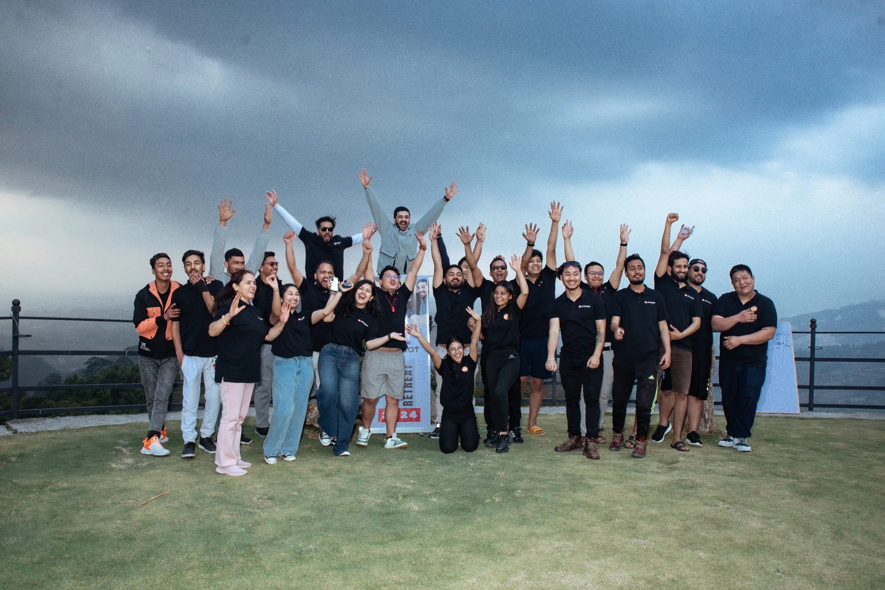

# Welcome to 

At Aricalot, our foundation is rooted in the belief that strong relationships are built upon trust, reliability, and exceptional quality. We pride ourselves on the enduring connections we establish with our customers through the consistent delivery of top-tier products. Every product we offer is a testament to our dedication to quality craftsmanship, meticulous attention to detail, and unwavering commitment to meeting and surpassing our customers' expectations.

We understand that each interaction is an opportunity to strengthen our relationships, and we strive to earn your trust by consistently delivering exceptional value, reliability, and superior quality in everything we do. Your satisfaction is not just our goal; it's the cornerstone of the relationships we build.

## Belief

**We build our relationship by delivering a quality product.**  
At Aricalot, our foundation is rooted in the belief that strong relationships are built upon trust, reliability, and exceptional quality. We pride ourselves on the enduring connections we establish with our customers through the consistent delivery of top-tier products. Every product we offer is a testament to our dedication to quality craftsmanship, meticulous attention to detail, and unwavering commitment to meeting and surpassing our customers' expectations.

We understand that each interaction is an opportunity to strengthen our relationships, and we strive to earn your trust by consistently delivering exceptional value, reliability, and superior quality in everything we do. Your satisfaction is not just our goal; it's the cornerstone of the relationships we build.

## Engineering Tools

We leverage advanced engineering tools to ensure precision and excellence in our work.

### Programming Languages

- <code></code> **Java**: A versatile and widely-used programming language.
- <code></code> **Python**: Known for its readability and efficiency, perfect for a variety of applications.
- <code></code> **Node.js**: Enables server-side scripting with JavaScript.

### Front-End Frameworks

- <code></code> **React**: A powerful library for building user interfaces.
- <code></code> **Flutter**: A UI toolkit for building natively compiled applications for mobile, web, and desktop.

### Databases

- <code></code> **PostgreSQL**: A powerful, open source object-relational database system.
- <code></code> **MongoDB**: A NoSQL database for modern, scalable applications.

### Cloud Platforms

- <code></code> **Microsoft Azure**: A comprehensive set of cloud services to build, deploy, and manage applications.
- <code></code> **Amazon AWS**: A secure cloud services platform offering compute power, database storage, and more.

### DevOps Tools

- <code></code> **Jenkins**: An open source automation server which enables developers to build, test, and deploy their software.
- <code></code> **Docker**: A tool designed to make it easier to create, deploy, and run applications by using containers.
- <code></code> **Kubernetes**: An open-source system for automating the deployment, scaling, and management of containerized applications.

## Visit Us

Learn more about us and explore our products on our [website](https://aricalot.com/).

---

Thank you for being a part of the Aricalot family. We look forward to building a lasting relationship with you.